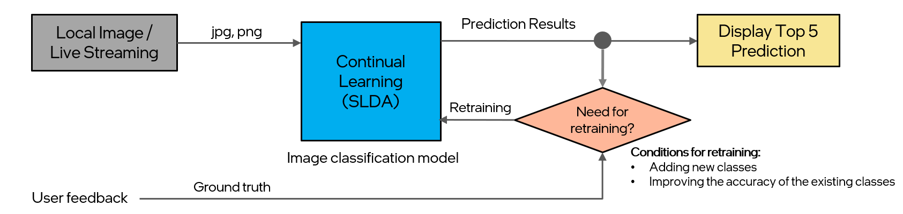

# Continual Learning Demo

## Description

This software package delivers the building blocks required to develop an AI-powered weighing scale use case that continuously learns and refines its image classification model with incoming new data. This reference implementation provides an intuitive application that facilitates an image classification model to learn incrementally with new image samples (sourced either from local images folder or live streaming feed). The continual learning algorithm is based on Streaming Linear Discriminant Analysis (SLDA) [[1]](#references) enabling the model to learn from individual images without forgetting previously acquired knowledge, resulting in faster training performance with comparable accuracy (Top1/Top5). This solution is optimally suited for CPU utilization, ensuring its adaptability across diverse hardware setups.



## Installation
```bash
# create a virtual environment for installation.
$> sudo apt install -y python3-venv python3-tk

# Create a venv outside this library and activate it.
$> python3 -m venv ../venv
$> source ../venv/bin/activate
$> python3 -m pip install -U pip

# Install packages
$> pip install -r requirements.txt
```

## Getting Started: GUI Demo

1. To initiate the GUI demo, execute the following command from the root directory of the project (with venv activated):
    ```bash
    streamlit run app.py
    ```

2. Navigate to the local URL provided in the terminal using a web browser. After opening the web browser, you will see the Continual Learning Demo page. The first run may be slower as the model is being downloaded and initialized.

During execution, if cache clearing is necesssary (i.e. to reset the model and start learning from a new state), press `c` key, follow the on-screen instructions and refresh the page.

## Working Modes

This application supports the following two working modes:

1. **Local Images Mode**: Train and predict using images from the local directories. Folder name automatically serves as the ground truth labels during training.

2. **Live Streaming Mode**: Train and predict using the live camera feed. Labels must be manually specified for training purposes.


## Steps for Training and Prediction

1. **Training**:

    Mode 1: Local Images
    - Click on "Train per image" button to train the current displayed image for training.
    - Click on "Train per folder" button to train the current selected images folder for training.
    - Each folder name will be automatically used as the ground truth label.
    - Supported image extension: .png .jpg .jpeg .tiff .bmp

    Mode 2: Live Streaming Mode
    - Click on "Train per image" button to train the current video frame for training.
    - Manually input ground truth labels is required before initiating the training.

2. **Prediction**:

    - Click on "Predict" to ulitize the trained model for prediciting the class/label of the new images.
    - The GUI will display the top five predicted classes along with their respective confidence levels.
    - At least two classes need to be trained prior to making a prediction.

3. **Accuracy**

    - The cumulative accuracy metric provides an aggregated representation of testing accuracy, highlighting the overall performance of the model across all predicted images.
    - This metric is specifically applicable to the "Local Images Mode" only, offering insights into the accuracy of current trained model.
    - Prediction accuracy relies on both the quality and the quantity of the image samples for the individual object. For better results, capture the object from various angles to increase the sample count.

## Image Folder Structure (Local Images Mode only)

1. Please ensure that the selected images folder for training/prediction has a clear folder structure, with each folder containing images related to a specific class.

    Example:
      - ClassA
        - image1.jpg
        - image2.jpg
        ...
      - ClassB
        - image1.jpg
        - image2.jpg
        ...
      - ClassC
        - image1.jpg
        - image2.jpg
        ...

Note: If adding training/prediction images within the `/use-cases/continual_learning/images` folder, please delete the `Green_Grape/Images.txt` and `Red_Apple/Images.txt` text files.

## SLDA Results Using Public Datasets

- We define each `partition` of the dataset as an individual `task`. Each `task` has `total_classes // num_tasks` unique classes.
- It is important to note that SLDA is ***task-agnostic*** algorithm.
- The algorithm requires no preconditioning upon changing tasks, and it can learn in a streaming fashion.

Backbone: `EfficientNetV2-B0` (Frozen across all tasks)

Accuracy: Top1/Top5 scores shown

1. Oxford-Flowers102 Dataset (1k Train, 6.1k Test Images)

    Note: This dataset by default comes with a test size larger than train size

    | Number of Partitions/Tasks       | Streaming LDA   |
    |----------------------------------|-----------------|
    | **Joint Training (All classes)** | **85.15/94.48** |
    | 5 Partitions                     | 85.03/94.45     |
    | 10 Partitions                    | 84.87/94.32     |
    | 20 Partitions                    | 85.12/94.65     |

2. Caltech-Birds 200 Dataset (6k Train, 4.7k Test Images)

    | Number of Partitions/Tasks       | Streaming LDA |
    |----------------------------------|---------------|
    | **Joint Training (All classes)** | **71.1/90.5** |
    | 5 Partitions                     | 70.7/90.7     |
    | 10 Partitions                    | 70.9/90.6     |
    | 20 Partitions                    | 71.0/90.6     |

Observations:
1. **SLDA** holds its own regardless of the number of partitions. This is primarily due to its *generative* nature. **SLDA** learns a per-class Gaussian that makes it *mostly* agnostic to the order of classes seen during training. It is a *generative* model over the *feature* space.
2. **SLDA** is heavily limited by the quality of the frozen backbone.


## References

> [1] Hayes, Tyler L., and Christopher Kanan. "Lifelong machine learning with deep streaming linear discriminant analysis." In Proceedings of the IEEE/CVF conference on computer vision and pattern recognition workshops, pp. 220-221. 2020.
